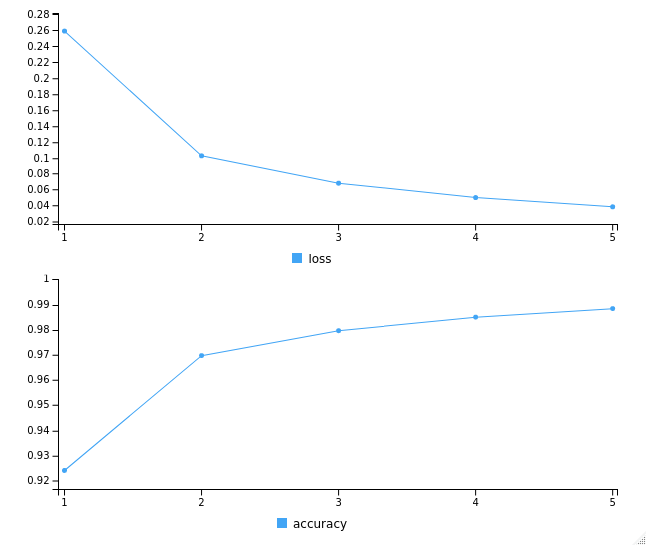

The original data can be downloaded from [NMIST](http://yann.lecun.com/exdb/mnist/).
The current notebook uses the data set from the package *Keras*.


<!-- Try executing this chunk by clicking the *Run* button within the chunk or by placing your cursor inside it and pressing *Ctrl+Shift+Enter*.  -->

<!-- Add a new chunk by clicking the *Insert Chunk* button on the toolbar or by pressing *Ctrl+Alt+I*. -->

<!-- When you save the notebook, an HTML file containing the code and output will be saved alongside it (click the *Preview* button or press *Ctrl+Shift+K* to preview the HTML file). -->

<!-- The preview shows you a rendered HTML copy of the contents of the editor. Consequently, unlike *Knit*, *Preview* does not run any R code chunks. Instead, the output of the chunk when it was last run in the editor is displayed. -->


Let's follow the example on Chapter 2 of Deep Learning with R, 2018, by Francois Collete and J.J. Altaire.


```{r}
library(keras)
mnist <- dataset_mnist()
train_images <- mnist$train$x
train_labels <- mnist$train$y
test_images <- mnist$test$x
test_labels <- mnist$test$y
```

## Data exploration

Let's look at the tensors in the data set. First the training data:

```{r}
str(train_images)
str(train_labels)
```

The images are stored in a 3d tensor of integers of dimensions 60000 x 28 x 28.
The labels in a 1d tensor of intengers of dimensions 60000 x 1 containing the digits the respective image represents.

And then the test data:

```{r}
str(test_images)
str(test_labels)
```

The test images are stored in a 3d tensor of integers of dimensions 10000 x 28 x 28.
The tes labels in a 1d tensor of intengers of dimensions 10000 x 1.


## Workflow

First the training data will be fed to the neural network. Then it will learn to associate an image with a label. Finally thye neural network will be asked to predict the labels for the test images, and a verification of how well the prediction is will be made.

### The network architecture

```{r}
network <- keras_model_sequential() %>% 
  layer_dense(units = 512, activation = "relu", input_shape = c(28*28)) %>%
  layer_dense(units = 10, activation = "softmax")
```

The layers are chained one after the next via the _pipe_ operator `%>%`. The represent a data sieve that produces more refined output as it apporaches the final output layer.

### The compilation step

```{r}
network %>% compile(
  optimizer = "rmsprop",
  loss = "categorical_crossentropy",
  metrics = c("accuracy")
)
```

The `keras` function `compile` modifies the `network` in place instead of returning a new object.

Before training the data has to be reshaped in preparation for the engine to consume it.

```{r}
train_images <- array_reshape(train_images, c(60000, 28*28))
train_images <- train_images / 255 # the values in the 28 x 28 matrix are one of 256 bits
str(train_images)
```
Now the training images consist of 47,040,000 elements in a 2d tensor of numbers of 60000 x 784.
Similarly for the testing data.

```{r}
test_images <- array_reshape(test_images, c(10000, 28*28))
test_images <- test_images / 255 # the values in the 28 x 28 matrix are one of 256 bits
str(test_images)
```

Now the test images consist of 7,840,000 elements in a 2d tensor of numbers of 10000 x 784.

```{r}
train_labels <- to_categorical(train_labels) # Converts a class vector (integers) to binary class matrix. 
test_labels <- to_categorical(test_labels)
```

### The training step

The network is ready to learn from the training data.

```{r}
network %>% fit(train_images,train_labels, epochs = 5, batch_size =128)
```


The plot generated during training shows how the learning progresses as the epochs go.
```{r echo=FALSE, out.width='50%'}
library(knitr)

```


### Evaluation

The metrics used are loss and accuracy.

```{r}
metrics <- network %>% evaluate(test_images, test_labels)
metrics
```

Predict the classes for the first ten samples in the test set.

```{r}
predicted_labels <- network %>% predict_classes(test_images[1:10,])
true_labels <- apply(test_labels[1:10,], MARGIN = 1, FUN = function(x) {c(0,1,2,3,4,5,6,7,8,9)[x == 1]})
m <- matrix(c(true_labels,predicted_labels),ncol = 2, byrow = FALSE)
colnames(m) <- c("true", "predicted")
rownames(m) <- seq(10)
m <- as.table(m)
m
```